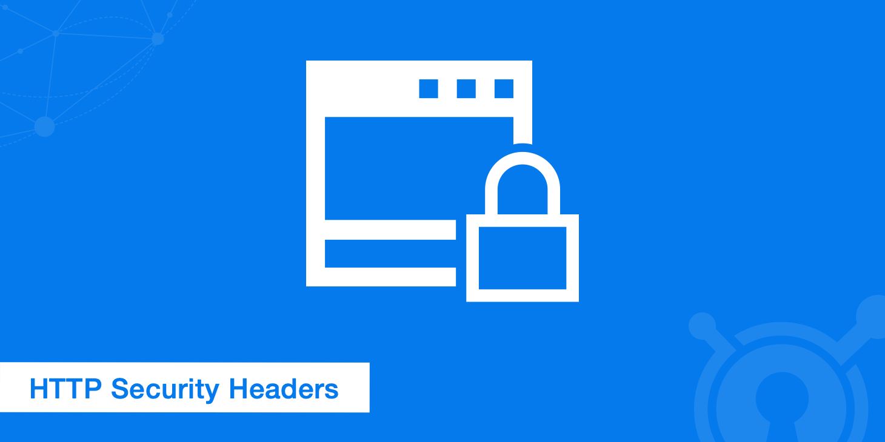
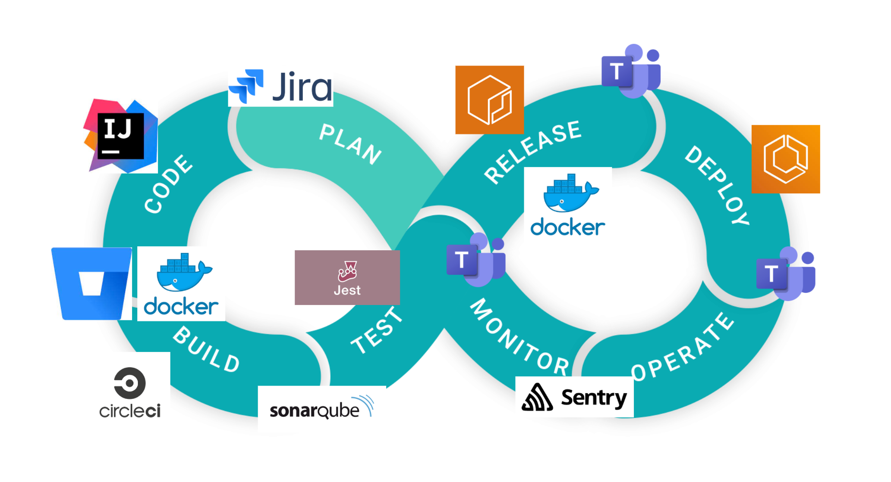
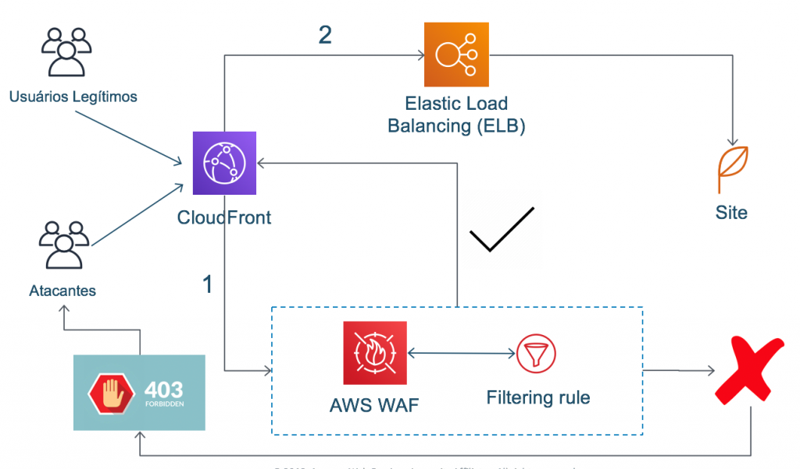
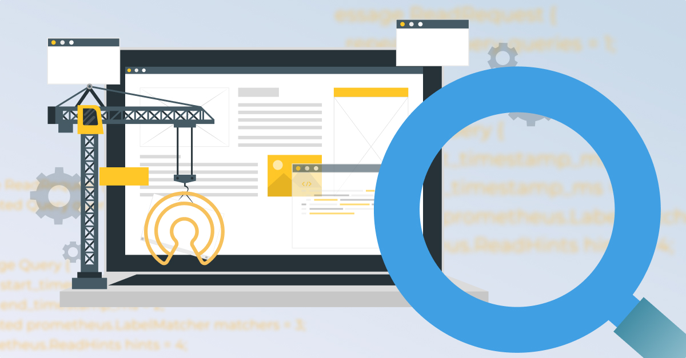
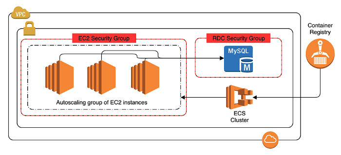
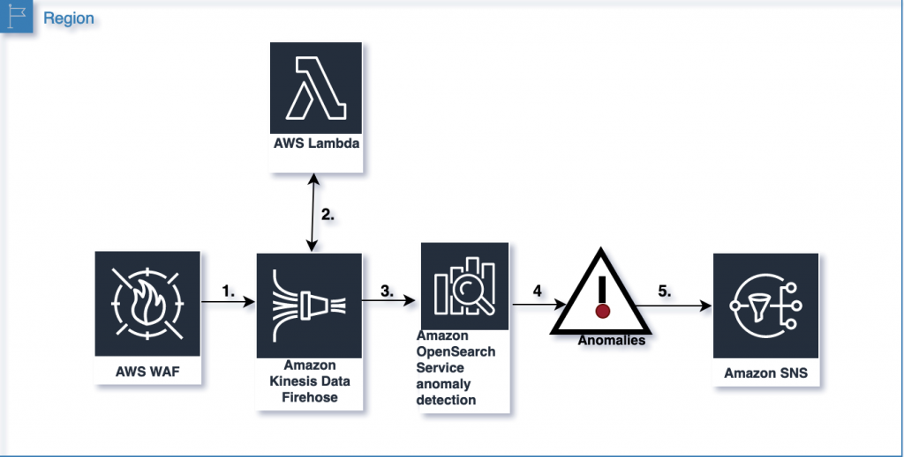
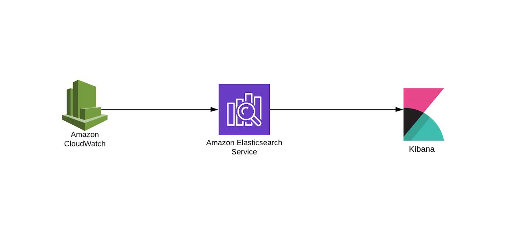

---

- [Branching](https://github.com/cdeucher/branching)
- [How the Web works](#requests)
- [Monorepo](#monorepo)
- [CI/CD](#cicd)

---
 

 
## [How the Web works](requests/requests.md)
 - [Cross-origin](requests/crossorigin.md)
 - [Security Headers](requests/headers.md) 

---
## Monorepo
 - [Setup - Monorepo](README_MONOREPO.md)

---
## CI/CD

  - [CircleCI - CodeQuality](.circleci/config.yml)
  - \*Manual Code Review
  - Automatic Code Review (Sonar)
      - Lint
      - Version Scan
      - SAST
  - DAST (ZAP)

---
## Deploy - S3/CLoudFront (Blue/Green)

 
## WAF - OWASP 

---
## Observability

---
# Backend

## ECS Cluster - Autoscalling

## WAF - OWASP 

## WAF - Anomaly detection

## Logging/Monitoring 

---
- [Deploy - S3/CLoudFront (Blue/Green)](https://github.com/cdeucher/terraform-aws-monorepo/tree/master/terraform-aws-s3-cloudfront)
    - Security Headers
    - Geographic restrictions
- [WAF - OWASP](#)
- [WAF - Anomaly detection](README_WAF.md)
- [Logging/Monitoring ](#)
- [Observability](#)
    - Sentry
    - Bugsnag
    - Datadog

\*Topic to discuss.

### Links
- [Markdown](https://github.github.com/gfm/#container-blocks)
