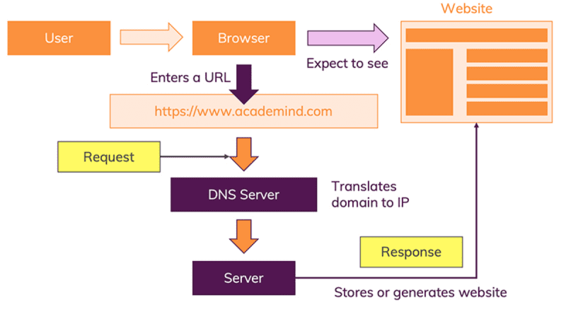

# [Voltar](../README.md)

# How the Web works

[Specification](https://www.w3.org/People/Frystyk/thesis/HTTPFeatures.html)

- [Request](https://developer.mozilla.org/en-US/docs/Learn/Getting_started_with_the_web/How_the_Web_works)

- [HTTP - HyperText Transfer Protocol](https://dev.opera.com/articles/http-basic-introduction/)

- [TCP/IP](https://en.wikipedia.org/wiki/Internet_protocol_suite)
    - [TCP/IP vs OSI model](https://www.guru99.com/difference-tcp-ip-vs-osi-model.html)

- Response

### Links
- [How the Web works](https://developer.mozilla.org/en-US/docs/Learn/Getting_started_with_the_web/How_the_Web_works)
- [How the web works](https://academind.com/tutorials/how-the-web-works)